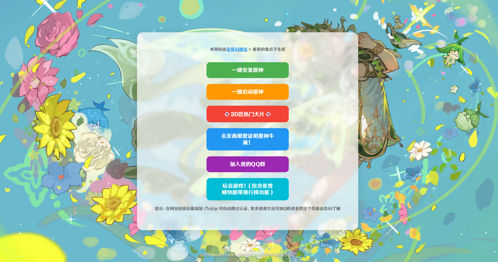

# 原神牛逼 · ysnb.com.cn


一个充满整活的「原神牛逼」网站，集年龄验证、人机验证、UID 查询（Enka / Minigg / 米游社）、友商拱火、热门视频整活于一体，是每个原神玩家的精神家园。😁😁😁😋😋😋😀😀😀😆😆😆🤓🤓🤓🤓

<p align="center">
  
</p>
<div align="center">

  [](https://github.com/VanillaNahida/ysnb.com.cn/blob/main/LICENSE)
  [](https://github.com/VanillaNahida/ysnb.com.cn/stargazers)
  [](https://github.com/VanillaNahida/ysnb.com.cn/network)
  [](https://github.com/VanillaNahida/ysnb.com.cn/issues)
  []()
  []()
  []()
  [](https://github.com/VanillaNahida)

</div>

# 功能特性

- **整活年龄验证**：选择出生日期，月份随机生成，日期滚动暂停——玩的就是心跳！
- **人机验证（Captcha）**：6 个跳动数字雪花屏，按目标数字顺序点击，点错 5 次可向AI投降！
- **UID 资深玩家验证**：滑动滑块输入 UID，查询 Enka / Minigg / 米游社三方 API，验证冒险等级 60 + 成就数 > 900
- **智能 API 回退**：查询失败自动切换下一个 API（米游社 → Enka → Minigg），支持 429 限流检测
- **一键安装原神**：根据 UA 自动匹配 Windows / Android / iOS / 鸿蒙下载链接；macOS 提示跳转云原神
- **一键启动原神**：直接跳转米哈游官方启动页😋
- **去友商那里证明原神牛逼**：随机跳转 30+ 款二游官网，整活拉满🤓
- **3D 区热门大片**：前 2 次固定整活视频，之后从热门片池随机抽选，每次点击都有新鲜感
- **URL 参数跳过**：访问 `/?skip` 直接跳过所有验证直达主界面
- **自定义弹窗系统**：页面内弹窗，兼容多浏览器
- **404 导航页**：优雅的 404 页面

# 项目结构

```
ysnb.com.cn/
├── index.html            # 主页面（单页应用，全部功能集成）
├── 404.html              # 优雅的 404 错误导航页
├── enkaapi.php           # PHP API 代理（Enka / Minigg / 米游社）
├── video-playlist.json   # 未满 18 岁跳转视频列表，非常的温馨阳光
├── hotvideo.json         # 热门大片随机视频列表
├── acg-game-list.json         # 友商游戏列表
├── favicon.ico           # 网站图标
├── .gitignore            # Git 忽略配置
└── README.md             # 本文件
```

# 快速开始

## 部署

1. 将项目文件上传到 Web 服务器（支持 PHP 8+ 和 HTTPS）
2. 确保 `enkaapi.php` 可被访问（用于 UID 查询）
3. （可选）配置本地米游社 API 服务 `http://127.0.0.1:3051/genshin/role-level`（bug太多了，先不开源吧！）

## 直接使用

访问 [https://ysnb.com.cn](https://ysnb.com.cn) 即可体验全部功能。

## URL 参数

| 参数 | 示例 | 说明 |
|------|------|------|
| `skip` | `/?skip` | 跳过所有验证，直达主界面 |

# API 参考

## UID 查询代理

```
GET /enkaapi.php?uid={uid}&source={source}
```

| 参数 | 类型 | 必填 | 说明 |
|------|------|------|------|
| `uid` | string | 是 | 原神 UID，纯数字，最长 9 位 |
| `source` | string | 否 | 数据源：`enka`（默认）/ `microgg` / `mys` |

**响应格式（enka / microgg）：**

```json
{
  "playerInfo": {
    "nickname": "玩家昵称",
    "level": 60,
    "signature": "签名",
    "worldLevel": 9,
    "finishAchievementNum": 1065,
    "_source": "enka"
  }
}
```

**响应格式（mys - 米游社）：**

```json
{
  "playerInfo": {
    "nickname": "玩家昵称",
    "level": 60,
    "signature": "",
    "worldLevel": -1,
    "finishAchievementNum": 1065,
    "_source": "mys"
  }
}
```

> 注意：米游社 API 不支持签名和世界等级查询，`worldLevel` 返回 `-1` 表示不支持。

## 视频列表

```
GET /hotvideo.json
```

返回 B 站视频链接数组，供"3D 区热门大片"按钮随机抽取。

# 验证流程

```
年龄验证（确认年满 18 岁）
    ↓
出生日期选择（月份随机 + 日期滚动暂停）
    ↓
人机验证（6 位跳动数字按序点击）
    ↓
UID 查询（冒险等级 60 + 成就数 > 900）
    ↓
🎉 恭喜通关 → 主界面
```

可选：访问 `/?skip` 一键跳过全部验证。

# 查询顺序

UID 查询失败时自动按以下顺序回退：

1. **米游社 API**（本地 Mys 服务，缓存 2 周）
2. **Enka API**（enka.network）
3. **Microgg API**（profile.microgg.cn）

全部失败后显示错误提示。

# 作弊模式🤓

| 操作 | 说明 |
|------|------|
| 点击游戏图标 10 次 | 弹出作弊窗口，可手动输入 UID |
| 人机验证失败 5 次 | 出现"投降"按钮 |
| 输入"跳过" | 在作弊窗口中输入可跳过 UID 验证 |

# 开发

本项目为纯前端单页应用 + PHP API 代理：

- **前端**：原生 HTML5 + CSS3 + JavaScript（无框架依赖）
- **后端**：PHP 8+ 代理转发
- **字体**：米哈游原神官方字体（zh-cn.ttf）

# Bug 反馈

如果在使用过程中遇到任何问题，请通过以下方式反馈：

- [GitHub Issues](https://github.com/VanillaNahida/ysnb.com.cn/issues)
- QQ 群：[xcnahida.cn/contact](https://xcnahida.cn/contact)

# Star History

[](https://star-history.com/#VanillaNahida/ysnb.com.cn&Date)
